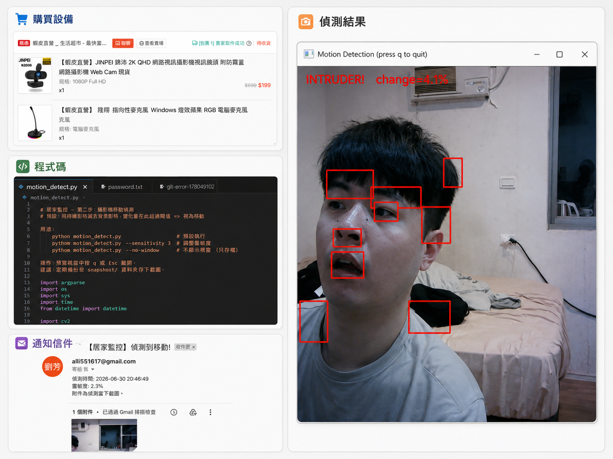

<p align="center">
  
</p>

# 居家監控 (Home Surveillance)

用一支普通的電腦攝影機，做即時**移動偵測**。偵測到入侵者時自動存下截圖，並寄 Email 通知你（可附當下畫面）。

## 功能特色

- 🎥 **移動偵測**：用 MOG2 背景相減，畫面變化超過門檻就觸發警報
- 🟩 **即時預覽**：在視窗上即時框出變化區塊（綠框監控中、紅框入侵中）
- 📸 **自動截圖**：觸發當下把原始畫面存到 `snapshots/`
- 📧 **Email 通知**：偵測到入侵自動寄信，並附上截圖
- 🔇 **抗雜訊設計**：暖機學背景、最小面積過濾、警報冷卻，避免狂報警 / 狂寄信
- 🛠️ **裝置測試**：先確認攝影機與麥克風能正常存取

## 環境需求

- Python 3.8+
- Windows（程式針對 Windows 主控台與 `CAP_DSHOW` 做了調整，其他平台也可跑但未測）

安裝套件：

```powershell
pip install opencv-python sounddevice numpy
```

> `sounddevice` 與 `numpy` 只有麥克風測試會用到，不需要可略過。

## 快速開始

### 1. 測試裝置

先確認攝影機（與麥克風）正常：

```powershell
python test_devices.py            # 攝影機 + 麥克風都測
python test_devices.py --camera   # 只測攝影機
python test_devices.py --mic      # 只測麥克風
```

### 2. 設定 Email 通知

帳密**不寫在程式裡**，有兩種設定方式（擇一）：

**方式 A — 環境變數**（PowerShell，只在當前視窗有效）：

```powershell
$env:EMAIL_USER = "你的gmail@gmail.com"
$env:EMAIL_PASS = "應用程式密碼(16碼)"
$env:EMAIL_TO   = "收件人@example.com"   # 不設則寄給自己
```

**方式 B — `password.txt`**（放在專案目錄，已被 `.gitignore` 排除）：

```
你的gmail@gmail.com
應用程式密碼(16碼)
收件人@example.com    ← 可省略，省略則寄給自己
```

> ⚠️ Gmail 需先開啟兩步驟驗證，再到 [Google 應用程式密碼](https://myaccount.google.com/apppasswords) 產生 16 碼密碼（**不是**登入密碼）。

寄一封測試信確認設定成功：

```powershell
python email_notify.py
```

### 3. 啟動監控

```powershell
python motion_detect.py                 # 預設參數
python motion_detect.py --sensitivity 3 # 調整靈敏度
python motion_detect.py --no-window     # 背景執行(不顯示視窗)
```

預覽視窗中按 `q` 或 `Esc` 離開。

## 參數說明 (`motion_detect.py`)

| 參數 | 預設 | 說明 |
| --- | --- | --- |
| `--camera-index` | `0` | 攝影機 index |
| `--sensitivity` | `2.0` | 觸發門檻：變化區域占畫面百分比，**越小越靈敏** |
| `--min-area` | `500` | 忽略小於此像素面積的變化（過濾雜訊） |
| `--cooldown` | `3.0` | 兩次警報的最短間隔秒數 |
| `--warmup` | `30` | 啟動後先學背景的影格數，期間不報警 |
| `--email-cooldown` | `20.0` | 兩封 Email 的最短間隔秒數，避免狂寄 |
| `--no-window` | — | 不顯示預覽視窗（背景執行） |
| `--no-save` | — | 不保留截圖 |
| `--no-email` | — | 關閉 Email 通知 |

## 運作原理

1. **背景相減**：`createBackgroundSubtractorMOG2` 持續學習背景，移動物體被標成前景。
2. **去雜訊**：去陰影 → 中值濾波 → 膨脹，讓前景遮罩更乾淨。
3. **判斷觸發**：找出變化區塊，計算占整個畫面的百分比，超過 `--sensitivity` 即視為入侵。
4. **警報**：存截圖 + 寄 Email（兩者各有獨立冷卻，避免重複觸發）。

## 專案結構

```
camara/
├── test_devices.py    # 步驟一:攝影機 / 麥克風測試
├── motion_detect.py   # 步驟二:移動偵測主程式
├── email_notify.py    # Email 通知模組(也可單獨當測試信工具)
├── password.txt       # Email 帳密(機密,已被 .gitignore 排除)
└── snapshots/         # 觸發時的截圖(自動產生)
```

## 安全與隱私

- `password.txt`、`snapshots/` 都已列入 `.gitignore`，不會被 commit。
- 帳密請務必使用 Gmail **應用程式密碼**，不要使用主帳號登入密碼。
- 截圖含個人隱私，請自行妥善保管或定期清除。
